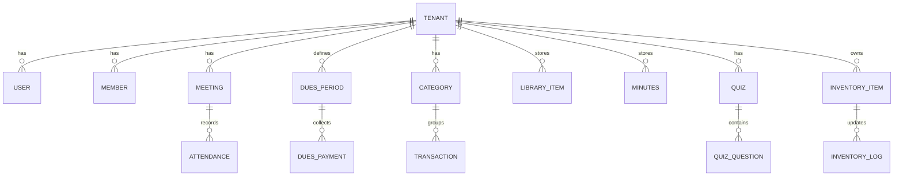

# Arquitetura do Projeto

## Stack Tecnológica

### Frontend + Backend
- **Framework**: Next.js 16 (App Router)
- **Linguagem**: TypeScript 5
- **Runtime**: Node.js 20+

### Styling
- **CSS Framework**: Tailwind CSS 4
- **PostCSS**: @tailwindcss/postcss
- **Componentes UI**: shadcn/ui (a ser integrado)

### Banco de Dados
- **Desenvolvimento**: SQLite
- **Produção**: Neon PostgreSQL
- **ORM**: Prisma ou Drizzle (a definir)

### Autenticação
- **Método**: JWT (JSON Web Tokens)
- **Validade**: 7 dias
- **Armazenamento**: Cookie httpOnly
- **Segurança**: Rate limiting no login

## Estrutura do Projeto

```
EsferaORDO/
├── app/                      # Aplicação principal Next.js
│   ├── src/
│   │   └── app/             # App Router do Next.js
│   │       ├── layout.tsx   # Layout raiz com fontes
│   │       ├── page.tsx     # Página inicial
│   │       ├── globals.css  # Estilos globais + Tailwind
│   │       └── favicon.ico
│   ├── public/              # Arquivos estáticos
│   ├── DOCS/                # Documentação original (PRD)
│   ├── next.config.ts       # Configuração Next.js
│   ├── tsconfig.json        # Configuração TypeScript
│   ├── eslint.config.mjs    # Configuração ESLint
│   ├── postcss.config.mjs   # Configuração PostCSS
│   └── package.json
├── DOCS/                     # Documentação organizada
├── CLAUDE.md                # Guia para Claude Code
└── slider_1/                # Protótipo legado (separado)
```

## Configurações Importantes

### TypeScript (tsconfig.json)
- **Target**: ES2017
- **Module**: ESNext
- **JSX**: react-jsx
- **Strict Mode**: Ativado
- **Path Alias**: `@/*` → `./src/*`

### ESLint
- Configuração: Next.js core-web-vitals + TypeScript
- Ignores: `.next/`, `out/`, `build/`, `next-env.d.ts`

### Fontes
- **Sans**: Geist (via next/font)
- **Mono**: Geist Mono (via next/font)
- Otimização automática pelo Next.js

## Modelagem de Dados

### Princípios
1. **Multi-tenant desde o início**: Todos os modelos incluem `tenant_id`
2. **Auditoria**: Todos os modelos incluem `created_at` e `updated_at`
3. **Soft Delete**: Exclusões lógicas quando aplicável

### Entidades Principais



### Tabelas Core

#### TENANT
- `id`, `name`, `created_at`, `updated_at`
- Representa cada Loja Maçônica

#### USER
- `id`, `tenant_id`, `email`, `password_hash`, `role`, `created_at`, `updated_at`
- Usuários do sistema (admin, tesoureiro, secretário, membro)

#### MEMBER
- `id`, `tenant_id`, `name`, `status`, `grade`, `created_at`, `updated_at`
- Status: Ativo / Inativo / Em admissão

#### MEETING
- `id`, `tenant_id`, `date`, `type`, `notes`, `created_at`, `updated_at`
- Sessões da Loja

#### ATTENDANCE
- `id`, `meeting_id`, `member_id`, `status`, `created_at`, `updated_at`
- Status: Presente / Falta / Justificada

#### DUES_PERIOD
- `id`, `tenant_id`, `month`, `year`, `default_amount`, `created_at`, `updated_at`
- Competências de mensalidades

#### DUES_PAYMENT
- `id`, `dues_period_id`, `member_id`, `amount`, `paid_at`, `payment_method`, `notes`, `created_at`, `updated_at`
- Pagamentos de mensalidades

#### CATEGORY
- `id`, `tenant_id`, `name`, `type`, `created_at`, `updated_at`
- Type: Receita / Despesa

#### TRANSACTION
- `id`, `tenant_id`, `category_id`, `amount`, `date`, `description`, `payment_method`, `attachment_url`, `created_at`, `updated_at`
- Receitas e despesas

#### INVENTORY_ITEM
- `id`, `tenant_id`, `name`, `category`, `quantity`, `unit`, `location`, `min_stock`, `created_at`, `updated_at`
- Itens do inventário

#### INVENTORY_LOG
- `id`, `inventory_item_id`, `type`, `quantity`, `date`, `source_destination`, `notes`, `created_at`, `updated_at`
- Type: Entrada / Saída

## Segurança

### Autenticação
- JWT armazenado em cookie httpOnly (não em localStorage)
- Tokens com expiração de 7 dias
- Middleware de proteção de rotas

### Autorização
- Role-based access control (RBAC)
- Isolamento por tenant
- Permissões por módulo

### Rate Limiting
- Login: máximo de tentativas por IP
- APIs sensíveis: throttling configurável

### Auditoria
- Log de ações críticas (financeiro, alterações de membros)
- Rastreabilidade com `created_at` e `updated_at`

## Performance

### Metas
- Páginas principais: < 2s em 4G
- First Contentful Paint: < 1.5s
- Time to Interactive: < 3s

### Otimizações
- Server-side rendering (SSR) quando necessário
- Static generation para páginas públicas
- Image optimization via next/image
- Code splitting automático (Next.js)
- Font optimization (next/font)

## Deploy e Ambientes

### Desenvolvimento
- SQLite local
- Servidor: `npm run dev` (http://localhost:3000)
- Hot reload ativado

### Produção
- Neon PostgreSQL (serverless)
- Vercel ou servidor Node.js
- Variáveis de ambiente para secrets

### Variáveis de Ambiente (a configurar)
```
DATABASE_URL=
JWT_SECRET=
EMAIL_PROVIDER_KEY=
BOLETO_PROVIDER_KEY=
STORAGE_BUCKET=
```

## Integrações Futuras

### E-mail
- Provider simples (ex: SendGrid, Resend)
- Templates para: inadimplência, comunicados, lembretes

### Boletos
- 1 provider inicial (ex: Asaas)
- Fluxo manual de emissão
- Webhook para atualização de status (futuro)

### Storage
- Desenvolvimento: filesystem local
- Produção: S3/R2/similar
- Uploads: documentos, anexos financeiros

## Observabilidade

### Logs
- Erros de API
- Falhas de autenticação
- Ações financeiras críticas

### Monitoring (futuro)
- Uptime
- Performance metrics
- Error tracking (Sentry ou similar)
