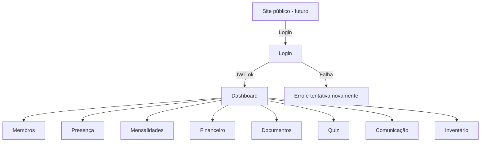
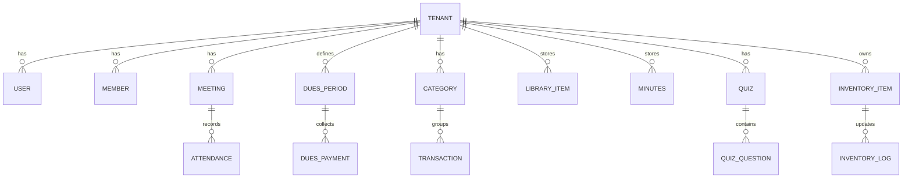

# PRD — Sistema de Gestão para Loja Maçônica (Rito Escocês Retificado • Mestre de Santo André)

## 1) Visão geral

Este projeto é um **sistema web (SaaS-ready)** para gestão administrativa e financeira de uma **Loja Maçônica do Rito Escocês Retificado (RER)**, com foco em **uso mobile** (maioria acessará pelo celular), simplicidade e velocidade de implantação (sem over engineering).

**Missão do produto:**

> Garantir organização, transparência e previsibilidade da gestão da Loja — presença, mensalidades, receitas/despesas, atas, **inventário de materiais** e comunicação — com uma experiência moderna, rápida e segura, acessível pelo celular.

O sistema terá:

- **Dashboard** pós-login como tela central (primeira entrega)
- Módulos: **Presença**, **Mensalidades**, **Receitas**, **Despesas**, **Balanços**, **Admissão**, **E-mails**, **Boletos**, **Biblioteca**, **ATAs**, **Inventário**, **Quiz**
- **Arquitetura Next.js fullstack** (front + back) e **PostgreSQL no Neon** em produção, **SQLite** no desenvolvimento
- **Autenticação JWT** (login por e-mail) com validade de **1 semana**
- Pronto para evoluir para **multi-tenant** (SaaS) desde o início (mínimo necessário)

---

## 2) Sobre o produto

O sistema combina práticas comuns em softwares de **membership / club management**: **cadastro de membros**, **cobrança de mensalidades**, **comunicação**, **eventos/presença**, **relatórios** e **analytics**.

**Referência de interface (UI) a ser seguida (principal):** sua última tela (Esfera NR6) deve ser a base do padrão de CRUD e consulta:

- **Sidebar fixa** com ícones + labels
- **Topbar** com busca, ações rápidas e usuário
- **Cards de KPI** no topo (ex.: membros ativos, adimplência, saldo)
- **CTA forte** (“+ Novo …”)
- **Tabela principal** com colunas claras e ações por ícones (visualizar / editar / excluir / imprimir)
- Visual limpo e responsivo, com foco em **leitura rápida** e **toque** no celular

**Referências visuais secundárias (dashboards Power BI):**

- Uso de **gradientes**, **cards arredondados**, **contraste alto**, e **cores de estado** (verde/ok, vermelho/alerta, dourado/destaque)
- Filtros superiores (mês/ano/trimestre) e gráficos simples (barras/linha/donut)

---

## 3) Propósito

- Substituir planilhas e controles manuais por uma fonte única de verdade
- Reduzir inadimplência com visibilidade + lembretes
- Facilitar prestação de contas e planejamento (balanços mensal/trimestral/anual)
- Organizar documentos (ATAs, biblioteca) e engajar (quiz)
- **Controlar o inventário de materiais** (paramentos, equipamentos, suprimentos) com rastreabilidade de entradas/saídas

---

## 4) Público alvo

1. **Tesoureiro / Secretário** (principal operador)
2. **Venerável / Administração** (aprovação, visão global)
3. **Obreiros (membros)** (consulta de mensalidades, presença, documentos, quiz)
4. **Candidatos / Admissão** (fluxo controlado, permissões limitadas)

---

## 5) Objetivos

- **O1:** Ter um dashboard confiável com KPIs financeiros e administrativos
- **O2:** Controlar presença por sessão e gerar relatórios
- **O3:** Controlar mensalidades (previsto x pago) e histórico por membro
- **O4:** Controlar receitas e despesas por categoria, com anexos e trilha de auditoria
- **O5:** Emitir balanços e exportações (PDF/CSV)
- **O6:** Organizar biblioteca e ATAs por período
- **O7:** Disponibilizar quiz com ranking (engajamento)
- **O8:** Preparar o caminho para boletos e e-mails automatizados (sem complexidade no início)
- **O9:** Controlar inventário (estoque atual + movimentações + alertas de mínimo)

---

## 6) Requisitos funcionais

> Convenção: **RF-XX**

### RF-01 — Autenticação e sessão (JWT)

- Login por **e-mail + senha**
- JWT com validade de **7 dias**
- Logout
- Proteção de rotas (middleware/guard)
- Troca de senha por e-mail *(pós login básico)*

### RF-02 — Dashboard

**KPIs (mínimo):**

- Membros ativos
- % adimplência (mês atual)
- Receita do mês
- Despesa do mês
- Saldo do mês e saldo acumulado
- Próxima sessão (data) e “faltas no mês”

**Gráficos (mínimo):**

- Receitas vs despesas (últimos 6 meses)
- Donut: adimplentes vs inadimplentes (mês)
- Ranking simples: top contribuintes (opcional)

### RF-03 — Membros (CRUD padrão Esfera NR6)

- Listagem com busca e filtros (ativo, grau/categoria, situação)
- Cadastro/edição com dados pessoais mínimos
- Situação: Ativo / Inativo / Em admissão
- Ações: visualizar, editar, excluir (soft delete), imprimir ficha

### RF-04 — Presença

- Cadastro de **Sessão** (data, tipo, observações)
- Marcação: Presente / Falta / Justificada (mobile-friendly)
- Relatórios:
  - Por período
  - Por membro
  - Ranking de assiduidade
- Exportar CSV

### RF-05 — Mensalidades

- Definir valor padrão por Loja
- Competência (mês/ano)
- Registrar pagamento (data, valor, meio, observação, anexo opcional)
- Situação: Pago / Parcial / Em aberto
- Visão por membro (histórico)
- Visão por competência (pagantes/inadimplentes)
- Exportar CSV

### RF-06 — Receitas

- CRUD: data, valor, categoria, descrição, forma, anexos
- Relatórios por período e categoria

### RF-07 — Despesas

- CRUD: data, valor, categoria, descrição, forma, anexos
- Relatórios por período e categoria

### RF-08 — Balanços (mensal, trimestral, anual)

- Total receitas, total despesas, resultado, comparativo vs período anterior
- Exportar PDF/CSV *(PDF pode ser posterior)*

### RF-09 — Admissão

- Status: Em análise → Aprovado → Iniciado / Reprovado / Desistiu
- Campos mínimos
- Datas e observações
- Permissões: candidato não acessa financeiro

### RF-10 — E-mails

- Enviar comunicados para: Todos / Inadimplentes / Ativos / Grupo
- Log de envio (status, data, destinatários)

### RF-11 — Boletos

- Emissão manual e/ou por competência
- Registrar retorno (pago/pendente/cancelado) *(webhook futuro)*
- Link/PDF quando disponível
- Começar com **1 provedor** (fluxo mínimo)

### RF-12 — Biblioteca

- Upload/registro de PDFs (título, autor, tema, ano, tags)
- Permissões: admin sobe; membros leem
- Busca e filtros
- Download/visualização

### RF-13 — ATAs

- ATA por sessão (data, título, texto/arquivo)
- Busca por período/tags
- Permissões por papel (admin edita)

### RF-14 — Quiz

- CRUD: Quiz + Perguntas (múltipla escolha)
- Execução mobile-first
- Pontuação e ranking por período
- Anti-fraude simples (ex.: 1 tentativa/dia por quiz)

### RF-15 — Inventário de materiais

- Cadastro de itens: nome, categoria, quantidade, unidade, localização (opcional), observações
- **Entradas:** registrar entrada (quantidade, data, origem/fornecedor, observação)
- **Saídas:** registrar saída (quantidade, data, destino/uso, observação)
- Histórico de movimentações (por item e por período)
- Exportar CSV
- (Opcional) Estoque mínimo por item + alerta

---

## 6.1) Fluxos de UX (Mermaid)

---

## 7) Requisitos não-funcionais

- **Mobile-first**
- **Performance:** páginas principais < 2s em 4G
- **Segurança:**
  - JWT em cookie httpOnly (preferência)
  - Rate limit no login
  - Auditoria mínima (ações críticas)
- **LGPD:** dados mínimos; política/consentimento (futuro)
- **Observabilidade:** logs de API e erros (simples)
- **Multi-tenant ready:** `tenant_id` desde os modelos
- **Compatibilidade:** Chrome/Android + Safari iOS

---

## 8) Arquitetura técnica

### 8.1 Stack

- Next.js (App Router) + TypeScript
- TailwindCSS
- **shadcn/ui** (componentes UI)
- ORM: Prisma **ou** Drizzle (escolher 1)
- DB dev: SQLite
- DB prod: Neon Postgres
- Auth: JWT (7 dias)
- Upload: local no dev; storage (S3/R2) no futuro

### 8.2 Padrões

- Código em inglês, UI em pt-BR
- `created_at` e `updated_at` em todas as tabelas

### 8.3 ERD (Mermaid)

---

## 9) Design system (Tailwind + shadcn/ui)

### 9.1 Direção visual (RER: verde, vermelho e ouro)

- **Tema:** escuro elegante + acentos rituais
- Verde: ações primárias
- Ouro: CTA e destaque
- Vermelho: perigo/alerta

### 9.2 Componentes (shadcn/ui)

- Layout: Sidebar/Topbar
- Card KPI
- Table + Pagination
- Dialog/Modal
- Dropdown Menu (ações)
- Form (inputs, select, textarea, checkbox)
- Toast (feedback)
- Tabs (perfil do membro)

---

## 10) User Stories (épicos)

- **E1:** Autenticação e acesso seguro
- **E2:** CRUD de membros
- **E3:** Presença por sessão
- **E4:** Mensalidades e inadimplência
- **E5:** Financeiro (receitas/despesas/balanços)
- **E6:** Documentos (biblioteca/atas) e Quiz
- **E7:** Inventário (itens + movimentações + alertas)

---

## 11) KPIs

**Produto**
- Tempo médio para registrar presença
- Tempo médio para registrar pagamento
- % uso mobile vs desktop

**Financeiro**
- % adimplência mensal
- Receita mensal/trimestral/anual
- Despesas por categoria
- Saldo acumulado

**Engajamento**
- Taxa de presença
- Participação em quiz (tentativas/semana)

---

## 12) Riscos e mitigação

- Over engineering: multi-tenant mínimo + sem billing avançado no início
- Boletos: 1 provedor + fluxo mínimo, webhook depois
- JWT no browser: cookie httpOnly + middleware + rate limit
- Mobile com tabelas: cards no mobile + filtros
- Upload e custo: começar simples e planejar storage

---
---

## 15) Links de referência (opcionais)

- Next.js Authentication Guide: https://nextjs.org/docs/pages/guides/authentication
- Neon Connection Pooling: https://neon.com/docs/connect/connection-pooling
- Asaas API: https://docs.asaas.com/docs/visao-geral
