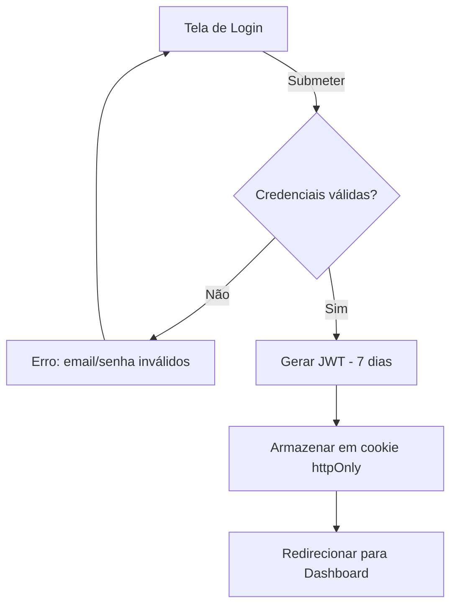
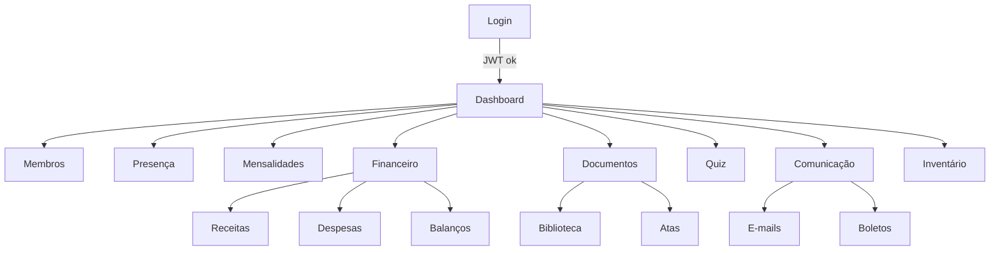

# Requisitos do Sistema

## Visão Geral

Sistema web SaaS para gestão administrativa e financeira de Lojas Maçônicas do Rito Escocês Retificado (RER), com foco em uso mobile, simplicidade e transparência.

### Missão
Garantir organização, transparência e previsibilidade da gestão da Loja através de controle de presença, mensalidades, receitas/despesas, atas, inventário e comunicação.

### Público-Alvo
1. **Tesoureiro / Secretário** - Principal operador
2. **Venerável / Administração** - Aprovação e visão global
3. **Obreiros (membros)** - Consulta de dados pessoais
4. **Candidatos** - Acesso limitado durante admissão

## Objetivos

- **O1**: Dashboard confiável com KPIs financeiros e administrativos
- **O2**: Controlar presença por sessão e gerar relatórios
- **O3**: Controlar mensalidades (previsto x pago) e histórico
- **O4**: Controlar receitas e despesas com auditoria
- **O5**: Emitir balanços e exportações (PDF/CSV)
- **O6**: Organizar biblioteca e atas
- **O7**: Disponibilizar quiz com ranking
- **O8**: E-mails e boletos automatizados
- **O9**: Controlar inventário de materiais

## Requisitos Funcionais

### RF-01: Autenticação e Sessão

**JWT com validade de 7 dias**

- Login por e-mail + senha
- Armazenamento em cookie httpOnly
- Logout
- Proteção de rotas via middleware
- Troca de senha (futuro)

**Exemplo de fluxo:**
```
Usuário → Tela de login → Valida credenciais → Gera JWT →
Cookie httpOnly → Redireciona para Dashboard
```

### RF-02: Dashboard

**KPIs principais:**
- Membros ativos
- % Adimplência (mês atual)
- Receita do mês
- Despesa do mês
- Saldo do mês e saldo acumulado
- Próxima sessão (data)
- Faltas no mês

**Gráficos:**
- Receitas vs Despesas (últimos 6 meses) - Linha/Barras
- Adimplentes vs Inadimplentes (mês) - Donut
- Ranking de contribuintes (opcional)

**Filtros:**
- Período (mês/trimestre/ano)

### RF-03: Membros (CRUD)

**Campos:**
- Nome completo
- E-mail
- Telefone
- CPF (opcional)
- Data de ingresso
- Status: Ativo / Inativo / Em admissão
- Grau/Categoria

**Funcionalidades:**
- Listagem com busca e filtros
- Criar novo membro
- Editar dados
- Excluir (soft delete)
- Visualizar perfil (abas: dados, presença, mensalidades)
- Imprimir ficha
- Exportar CSV

### RF-04: Presença

**Sessões:**
- Data
- Tipo (Ordinária, Extraordinária, Iniciação, etc.)
- Observações

**Marcação de presença:**
- Presente / Falta / Justificada
- Interface mobile-friendly (checkboxes/toggles)

**Relatórios:**
- Presença por período
- Presença por membro
- Ranking de assiduidade
- Exportar CSV

### RF-05: Mensalidades

**Competências:**
- Mês/Ano
- Valor padrão por Loja (configurável)

**Pagamentos:**
- Data de pagamento
- Valor
- Meio de pagamento (Dinheiro, PIX, Transferência, Boleto)
- Observações
- Anexo (comprovante - opcional)

**Status:**
- Pago
- Parcial
- Em aberto

**Visões:**
- Por membro: histórico completo
- Por competência: pagantes e inadimplentes
- Inadimplentes com alertas
- Exportar CSV

### RF-06: Receitas

**Campos:**
- Data
- Valor
- Categoria (ex: Mensalidades, Doações, Eventos)
- Descrição
- Forma de pagamento
- Anexos (comprovantes)

**Funcionalidades:**
- CRUD completo
- Relatórios por período
- Relatórios por categoria
- Exportar CSV

### RF-07: Despesas

**Campos:**
- Data
- Valor
- Categoria (ex: Aluguel, Água/Luz, Materiais, Eventos)
- Descrição
- Forma de pagamento
- Anexos (notas fiscais, recibos)

**Funcionalidades:**
- CRUD completo
- Relatórios por período
- Relatórios por categoria
- Exportar CSV

### RF-08: Balanços

**Periodicidade:**
- Mensal
- Trimestral
- Anual

**Conteúdo:**
- Total de receitas
- Total de despesas
- Resultado (receitas - despesas)
- Comparativo com período anterior
- Detalhamento por categoria

**Exportação:**
- CSV (imediato)
- PDF (futuro)

### RF-09: Admissão

**Fluxo:**
```
Em análise → Aprovado → Iniciado
          ↓
       Reprovado / Desistiu
```

**Campos:**
- Dados do candidato
- Data de inscrição
- Status
- Datas de progressão
- Observações

**Permissões:**
- Candidato não acessa módulo financeiro
- Acesso apenas a documentos permitidos

### RF-10: E-mails

**Destinatários:**
- Todos os membros
- Inadimplentes
- Ativos
- Grupo customizado

**Funcionalidades:**
- Envio de comunicados
- Templates (futuro)
- Log de envios (data, destinatários, status)

### RF-11: Boletos

**Geração:**
- Manual (individual)
- Por competência (em lote)

**Status:**
- Pendente
- Pago
- Cancelado

**Integração:**
- 1 provedor inicial (ex: Asaas)
- Link/PDF do boleto
- Webhook para atualização (futuro)

### RF-12: Biblioteca

**Documentos:**
- Título
- Autor
- Tema/Categoria
- Ano
- Tags
- Arquivo PDF

**Funcionalidades:**
- Upload (admin)
- Busca e filtros
- Download/Visualização (membros)
- Permissões por papel

### RF-13: Atas

**Campos:**
- Sessão vinculada (data)
- Título
- Texto ou arquivo anexo

**Funcionalidades:**
- CRUD (admin)
- Busca por período/tags
- Download/Visualização
- Permissões por papel

### RF-14: Quiz

**Estrutura:**
- Quiz (título, descrição)
- Perguntas (texto, múltipla escolha)
- Respostas (gabarito)

**Funcionalidades:**
- CRUD (admin)
- Responder quiz (membros)
- Pontuação automática
- Ranking por período
- Anti-fraude: 1 tentativa/dia por quiz

### RF-15: Inventário de Materiais

**Itens:**
- Nome
- Categoria (Paramentos, Equipamentos, Suprimentos)
- Quantidade atual
- Unidade (unidade, metro, litro, etc.)
- Localização (opcional)
- Estoque mínimo (alerta)
- Observações

**Movimentações:**
- Tipo: Entrada / Saída
- Quantidade
- Data
- Origem/Destino
- Observações

**Funcionalidades:**
- CRUD de itens
- Registrar entrada
- Registrar saída
- Histórico de movimentações (por item e por período)
- Alerta de estoque mínimo
- Exportar CSV

## Requisitos Não-Funcionais

### RNF-01: Performance
- Páginas principais carregam em < 2s em 4G
- First Contentful Paint < 1.5s
- Time to Interactive < 3s

### RNF-02: Mobile-First
- Design responsivo mobile-first
- Interface otimizada para toque
- Componentes adaptados (tabelas → cards)

### RNF-03: Segurança
- JWT em cookie httpOnly (não localStorage)
- Rate limiting no login (proteção contra brute force)
- Auditoria de ações críticas (financeiro, exclusões)
- Validação de inputs (XSS, SQL injection)
- HTTPS obrigatório em produção

### RNF-04: Multi-tenant
- Arquitetura preparada para SaaS
- `tenant_id` em todas as tabelas
- Isolamento de dados por tenant
- Queries sempre filtradas por tenant

### RNF-05: LGPD
- Coleta mínima de dados pessoais
- Política de privacidade (futuro)
- Consentimento explícito (futuro)

### RNF-06: Compatibilidade
- Chrome/Android (mobile)
- Safari/iOS (mobile)
- Chrome/Edge (desktop)

### RNF-07: Observabilidade
- Logs de erros de API
- Logs de falhas de autenticação
- Monitoramento de performance (futuro)

## Regras de Negócio

### RN-01: Membros
- Apenas membros ativos podem ter mensalidades ativas
- Soft delete: não excluir permanentemente (manter histórico)

### RN-02: Presença
- Uma sessão não pode ter duas marcações para o mesmo membro
- Apenas sessões criadas podem ter presença marcada

### RN-03: Mensalidades
- Competência única por mês/ano
- Valor pago não pode exceder valor previsto + tolerância (ex: 10%)
- Inadimplência = competências em aberto há mais de 30 dias

### RN-04: Financeiro
- Categoria de receita não pode ser usada em despesa e vice-versa
- Transações com anexos: validar tipos de arquivo (PDF, JPG, PNG)
- Datas futuras permitidas apenas para previsão (flag específica)

### RN-05: Inventário
- Saída não pode reduzir quantidade abaixo de zero
- Alerta quando quantidade ≤ estoque mínimo

### RN-06: Permissões
- Candidatos: acesso apenas a biblioteca (documentos permitidos) e quiz
- Membros: acesso completo exceto CRUD de categorias/configurações
- Admin/Tesoureiro: acesso total

### RN-07: Multi-tenant
- Usuário só acessa dados do seu tenant
- Queries sem `tenant_id` devem falhar

## Casos de Uso Principais

### UC-01: Registrar Presença em Sessão
**Ator:** Secretário
**Fluxo:**
1. Criar sessão (data, tipo)
2. Marcar presença de cada membro (presente/falta/justificada)
3. Salvar
4. Sistema atualiza estatísticas de assiduidade

### UC-02: Lançar Pagamento de Mensalidade
**Ator:** Tesoureiro
**Fluxo:**
1. Selecionar competência (mês/ano)
2. Selecionar membro
3. Informar valor, data, meio de pagamento
4. Anexar comprovante (opcional)
5. Salvar
6. Sistema atualiza % adimplência

### UC-03: Gerar Balanço Mensal
**Ator:** Tesoureiro
**Fluxo:**
1. Selecionar mês/ano
2. Sistema calcula total de receitas
3. Sistema calcula total de despesas
4. Gera relatório com resultado
5. Exportar CSV ou visualizar

### UC-04: Consultar Inadimplentes
**Ator:** Tesoureiro
**Fluxo:**
1. Acessar módulo de mensalidades
2. Filtrar por "Em aberto"
3. Sistema lista membros inadimplentes
4. Exportar lista para envio de lembretes

### UC-05: Registrar Saída de Material
**Ator:** Secretário
**Fluxo:**
1. Selecionar item do inventário
2. Informar quantidade de saída
3. Informar destino/uso
4. Salvar
5. Sistema atualiza quantidade
6. Sistema verifica se atingiu estoque mínimo (alerta)

## Diagramas

### Fluxo de Login


### Fluxo de Navegação


## Priorização (MoSCoW)

### Must Have (MVP)
- RF-01: Autenticação
- RF-02: Dashboard
- RF-03: Membros
- RF-04: Presença
- RF-05: Mensalidades
- RF-06: Receitas
- RF-07: Despesas

### Should Have
- RF-08: Balanços
- RF-12: Biblioteca
- RF-13: Atas
- RF-15: Inventário

### Could Have
- RF-09: Admissão
- RF-14: Quiz

### Won't Have (MVP) - Futuro
- RF-10: E-mails automatizados
- RF-11: Boletos
- Troca de senha por e-mail
- Templates de comunicação
- Webhooks de boletos
- Multi-idioma
- White-label

## Métricas de Sucesso

### Produto
- Tempo médio para registrar presença < 3 min
- Tempo médio para registrar pagamento < 2 min
- % de uso mobile ≥ 70%

### Financeiro
- % Adimplência mensal ≥ 80%
- Balanços gerados mensalmente
- Redução de inadimplência (comparativo)

### Engajamento
- Taxa de presença em sessões ≥ 75%
- Participação em quiz ≥ 50% dos membros

## Referências

Para detalhamento completo, consultar:
- `app/DOCS/PRD_Loja_Maconica_RER.md` - Product Requirements Document completo
- `DOCS/Arquitetura.md` - Detalhes técnicos de implementação
